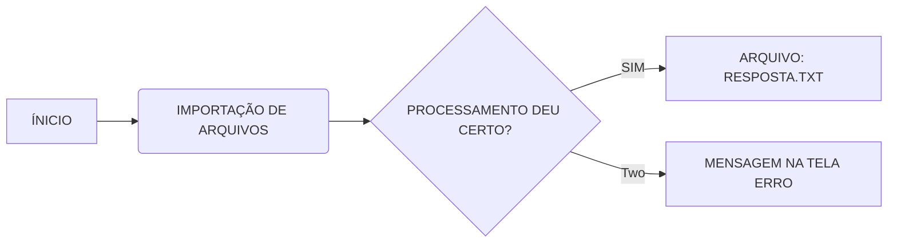

# Fluxogramas
Fuxogrmas de Etapas

Flowcharts
Exemplo de Fluxograma das Etapas do Projeto

```mermaid
graph LR
A[ÍNICIO] -->B(IMPORTAÇÃO DE ARQUIVOS)
    B --> C{PROCESSAMENTO DEU CERTO?}
    C -->|SIM| D[ARQUIVO: RESPOSTA.TXT]
    C -->|Two| E[MENSAGEM NA TELA ERRO]
```
